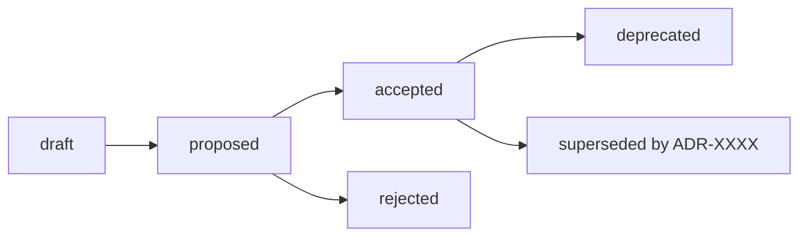

# SahiDawa — Architecture Decision Records

> **Single source of truth for architectural decisions.** This folder documents the significant, hard-to-reverse technical choices that shape SahiDawa — and, just as importantly, *why* they were made.

New to ADRs? Start with [ADR 0006 — Record Architecture Decisions](./0006-record-architecture-decisions.md), which establishes this system.

## Table of Contents

- [What is an ADR?](#what-is-an-adr)
- [Why ADRs?](#why-adrs)
- [Directory layout](#directory-layout)
- [Numbering rules](#numbering-rules)
- [Status definitions](#status-definitions)
- [When to create an ADR](#when-to-create-an-adr)
- [When not to create an ADR](#when-not-to-create-an-adr)
- [Review expectations](#review-expectations)
- [Creating a new ADR](#creating-a-new-adr)
- [Index of ADRs](#index-of-adrs)

---

## What is an ADR?

An **Architecture Decision Record (ADR)** is a short, focused document that captures a single consequential technical decision: the context that motivated it, the options considered, the choice made, and its consequences.

ADRs follow the lightweight [MADR](https://adr.github.io/madr/) (Markdown Architectural Decision Records) format already used across this repository, inspired by [Michael Nygard's original ADRs](https://cognitect.com/blog/2011/11/15/documenting-architecture-decisions).

## Why ADRs?

Architectural decisions are easy to make and hard to recover from. Without a
durable record, the *reasoning* behind a choice evaporates into merged PRs and
chat history, leaving future contributors to reverse-engineer intent or repeat
mistakes. ADRs make that reasoning explicit, searchable, and reviewable.

---

## Directory layout

```text
docs/adr/
├── README.md                                    ← You are here (index + process guide)
├── template.md                                  ← Copy this to start a new ADR
├── 0006-record-architecture-decisions.md        ← Foundational ADR (adopting ADRs)
├── 0001-use-turborepo-for-monorepo.md           ← Individual decisions
├── 0002-use-supabase-for-primary-database.md
└── …                                            ← One file per decision
```

| Resource | Purpose |
| --- | --- |
| [`0006-record-architecture-decisions.md`](./0006-record-architecture-decisions.md) | The ADR that establishes this system. |
| [`template.md`](./template.md) | Copy this to start a new ADR. Do not edit it in place. |
| `00NN-title.md` | Individual accepted/proposed decisions (e.g. `0001-use-turborepo-for-monorepo.md`). |

---

## Numbering rules

- Each ADR gets a **unique, sequential, zero-padded 4-digit number** (`0001`, `0002`, `0003`, …).
- Numbers are **never reused**, even if an ADR is rejected or superseded.
- The filename format is `NNNN-kebab-case-title.md` (e.g. `0007-use-postgres-for-audit-logs.md`).
- ADR `0006` is the foundational ADR that records the decision to adopt ADRs themselves.

---

## Status definitions

Every ADR carries a `Status` field. The lifecycle is:

| Status | Meaning |
| --- | --- |
| `draft` | Being written; not yet proposed for review. |
| `proposed` | Complete and open for discussion/review. |
| `accepted` | Approved and in effect. |
| `rejected` | Considered and deliberately not adopted. |
| `deprecated` | Was accepted but is no longer recommended. |
| `superseded by [ADR-XXXX]` | Replaced by a newer ADR (link to it). |

Once an ADR reaches `accepted`, its **decision is not changed by editing the file**.
To change direction, write a *new* ADR that marks the old one `superseded`. This
keeps the historical record intact.



---

## When to create an ADR

Create an ADR when a decision is:

- **Architecturally significant** — it shapes structure, dependencies, or data flow.
- **Hard to reverse** — changing it later is costly (e.g. a database, framework, or
  caching strategy).
- **Cross-cutting** — it affects multiple apps/packages or multiple contributors.
- **Likely to be questioned later** — future maintainers will want to know *why*.

Examples already documented here: adopting Turborepo (`0001`), Supabase (`0002`),
Redis caching (`0003`), LangGraph for triage (`0004`), and Next.js for the frontend
(`0005`).

## When **not** to create an ADR

Do **not** create an ADR for:

- Routine bug fixes, refactors with no behavioral change, or style/formatting.
- Local implementation details that don't affect the system's shape.
- Decisions already covered by an existing ADR (extend or supersede instead).
- Per-PR work tracking — that belongs in [`docs/devtrack/adr/`](../../docs/devtrack/adr/),
  which records individual contribution-level decisions, not project-wide architecture.

---

## Review expectations

- ADRs are proposed via a normal pull request and reviewed like code.
- The `Deciders` field should name the people accountable for the call (usually the
  core team or the issue assignee plus a maintainer).
- An ADR should be `accepted` only after at least one maintainer approves.
- Keep ADRs concise. Link to supporting docs (design docs, issues, PRs) rather than
  duplicating them.

---

## Creating a new ADR — quick steps

1. Copy [`template.md`](./template.md) to `NNNN-kebab-case-title.md` using the next
   free number.
2. Fill in `Status`, `Deciders`, `Date`, and every section.
3. Set `Status: proposed` and open a PR referencing the relevant issue.
4. After approval, set `Status: accepted` and merge.
5. Add the new ADR to the list below.

---

## Index of ADRs

| ADR | Title | Status |
| --- | --- | --- |
| [0006](./0006-record-architecture-decisions.md) | Record Architecture Decisions | accepted |
| [0001](./0001-use-turborepo-for-monorepo.md) | Use Turborepo for Monorepo Management | accepted |
| [0002](./0002-use-supabase-for-primary-database.md) | Use Supabase for Primary Database and Auth | accepted |
| [0003](./0003-use-redis-for-cache-aside-pattern.md) | Use Redis for Cache-Aside Pattern | accepted |
| [0004](./0004-use-langgraph-for-ml-triage.md) | Use LangGraph for ML Triage | accepted |
| [0005](./0005-use-nextjs-for-frontend.md) | Use Next.js for Frontend | accepted |
